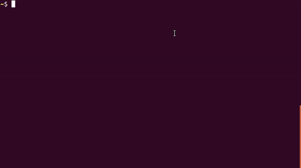

# pray-cli

CLI to get prayer timings


## Demo



## Installation

```shell script
wget "https://raw.githubusercontent.com/theapache64/pray-cli/master/install.sh" -q --show-progress -O install.sh && sh install.sh && source ~/.bashrc
```

## Author

theapache64